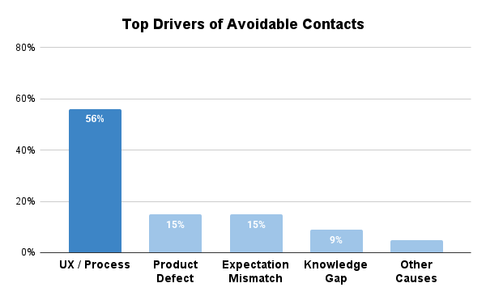

# Reducing Avoidable Customer Contacts  
*A CX transformation case study using Zendesk and VoC analysis*

---

## Executive Summary

Customer support demand is often treated as an operational issue. However, this analysis shows that a significant portion is driven by preventable customer experience failures.

- ~**68% of tickets are avoidable**  
- **UX/process failures (54%)** are the primary driver  
- **Billing and pre-sales issues drive volume**, but not dissatisfaction  
- **Low CSAT is driven by how issues are handled**, not by issue type alone  

> 🔴 Support demand is not a service problem, it is a symptom of upstream experience failures.

---

## Key Metrics

> ~68% of support demand is preventable, primarily driven by UX and process failures, not product issues.

## Key Insights

### 1. Majority of Demand Is Preventable

Most support demand is caused by systemic experience breakdowns, not isolated incidents.
- UX / process failures  
- expectation mismatch  
- product defects  

---

### 2. Volume Does Not Equal Impact

- Billing & pre-sales → highest volume  
- UX/process failures → lowest CSAT  

> High-volume issues are not necessarily the most damaging; handling quality determines customer satisfaction.

---

### 3. Handling Quality Drives Dissatisfaction

Customers are most frustrated by:
- repeated information requests  
- inconsistent or incomplete responses  
- lack of timely escalation  

> Poor handling amplifies dissatisfaction more than the issue itself.

## Business Impact

Reducing avoidable contacts directly improves both customer experience and operational efficiency.
- Reduced avoidable contacts by addressing UX and process failures
- Improved response consistency through standardized workflows
- Increased customer satisfaction (CSAT) by reducing repeated interactions and delays  

This positions CX as a driver of business performance, not just service operations.

## Actions Taken

- Standardized escalation rules to reduce delays  
- Eliminated repeated information requests  
- Improved first-response quality  
- Clarified billing and pre-sales communication  

Result:
- Reduced avoidable contacts  
- Improved first-response quality and consistency
- Increased customer satisfaction (CSAT)  

## Final Insight

Customer support is not just a resolution function — it is a diagnostic system for identifying and fixing systemic experience failures.

## Methodology

- Dataset: 545 Zendesk tickets  
- Root cause classification based on CX taxonomy  
- Avoidable contact defined as preventable through UX, process, or communication improvements  
- Validation conducted via manual case review  
